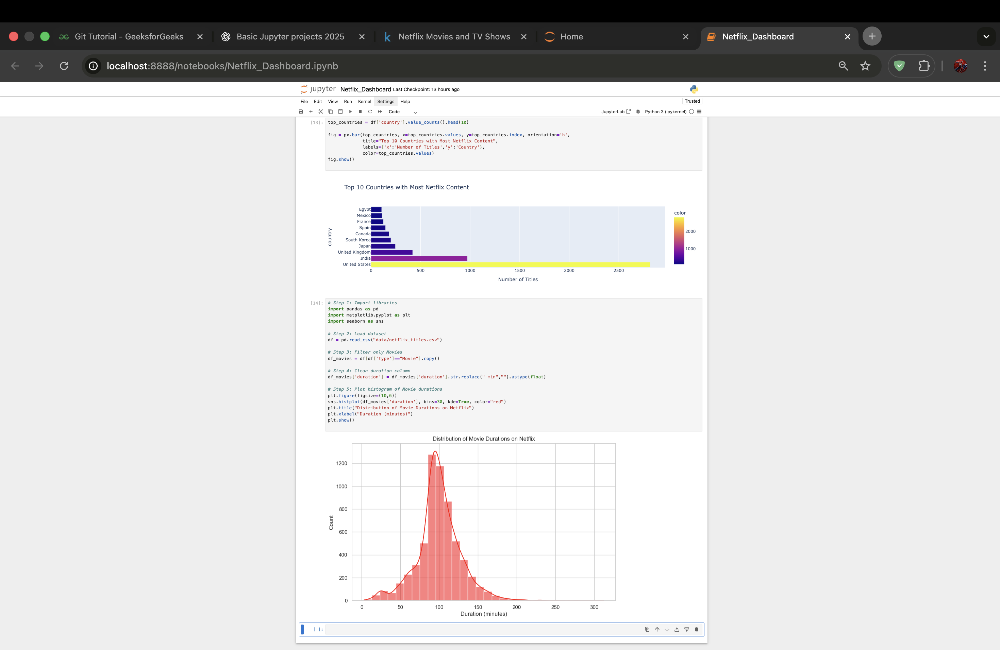
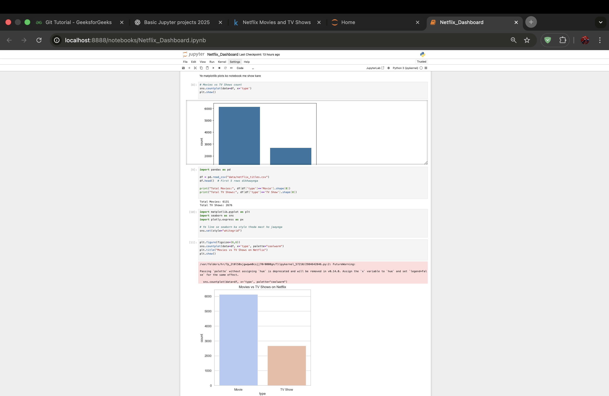

# Project Title

A brief description of your project, its purpose, and what it accomplishes.

---

## Table of Contents

- [Project Structure](#project-structure)
- [Installation](#installation)
- [Dataset Explanation](#dataset-explanation)
- [Usage](#usage)
- [Sample Output](#sample-output)
- [Contributing](#contributing)
- [License](#license)

---

## Project Structure

```
├── data/               # Dataset files
├── notebooks/          # Jupyter notebooks
├── src/                # Source code
│   └── main.py
├── requirements.txt    # Python dependencies
└── README.md           # Project documentation
```

---

## Installation

1. **Clone the repository:**
   ```bash
   git clone https://github.com/yourusername/your-repo.git
   cd your-repo
   ```

2. **Create a virtual environment (optional but recommended):**
   ```bash
   python3 -m venv venv
   source venv/bin/activate
   ```

3. **Install dependencies:**
   ```bash
   pip install -r requirements.txt
   ```

---

## Dataset Explanation

- **Location:** `data/`
- **Format:** (e.g., CSV, JSON)
- **Description:**  
  Briefly describe the dataset, its columns/features, and the source.  
  Example:  
  - `feature1`: Description  
  - `feature2`: Description

---

## Usage

Run the main script or open the Jupyter notebooks to explore the project:

```bash
python src/main.py
```

Or open `notebooks/` in JupyterLab or Jupyter Notebook.

---

## Sample Output

Below are example screenshots or outputs generated by the project:




---

## Contributing

Contributions are welcome! Please open issues or submit pull requests for improvements.

---

## License

This project is licensed under the [MIT License](LICENSE).


bakwaaaas haiii madarchoddd!!!!!!